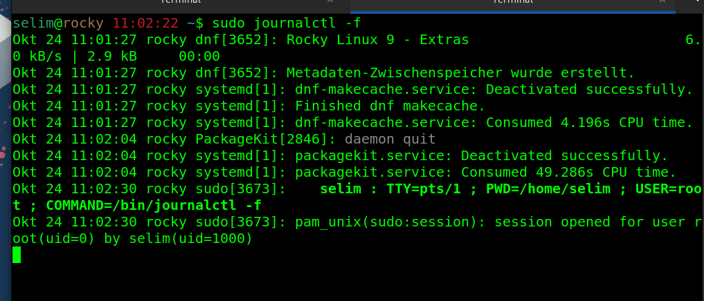

## journalctl


#### How to view all messages generated by the system since the last reboot.

We can get all the messages since last boot with " journalctl" command. 

````
journalct | grep ssh 
````


we can get logs for a specific service by piping with grep :

````
journalct | grep ssh 
````


-----

#### what are two different ways of showing the kernel messages:

```
dmesg`
````


````
journalctl -k
```


#### Wie können wir logdatei kontiniuerliche und live  sehen?

_mit " *** -f *** " Option_

````
journalctl -f 
````



_oder ,it dem  ```` tail -f /var/log/messages   ```` . /var/log(messages is the file all logs_

#### Where können wir die Messages reletet to Installation von Linux finedn  ? 

_dazu nutzen wir *** cat /var/log/anaconda/anaconda.log *** firl_

````
cat /var/log/anaconda/anaconda.log
````


#### Where are the most of the log files are located

*** /var/log/ *** 


