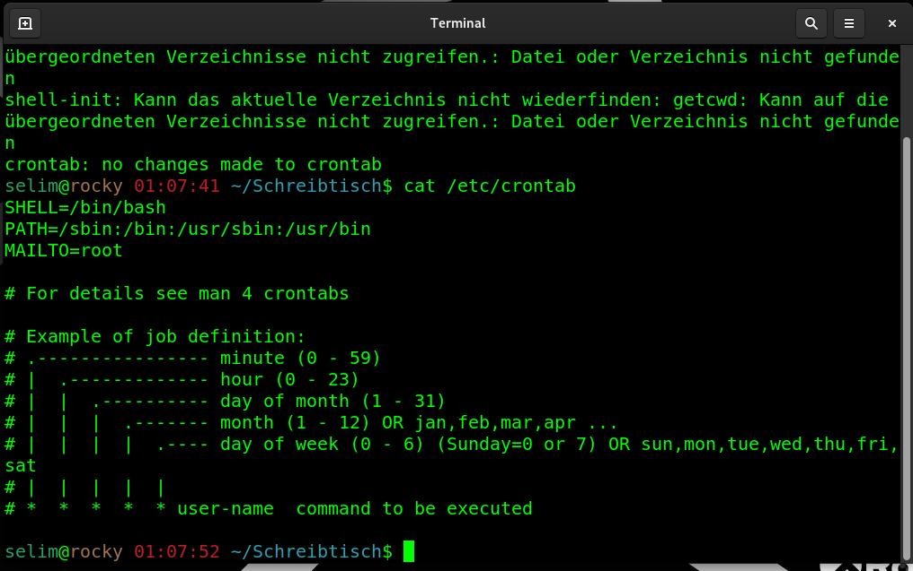

### improve performance , how we can safely to set limit of precess for the suoeruser root to be unlimited.

to see all ts set for root 
````
ulimt -a
````


to see maximum user processes alowed-
````
ulimit -u
````


to change ulimit tu unlimited
````
ulimit -u unlimited
````

 to change ulimitback to default 
````
ulimit -u 14269
````


### Where can you set the resources limits fot users logged in via PAM?
For any user logged in , thereis a file that we can look into, and set the user limit.
 We did it by typing ulimit command , but  we do it for any user through configuration file. 
 ***/etc/security/limits.conf*** 

````
nano /etc/security/limits.conf
````



### How to check mit for a user.
*** ulimit -a *** checks for a user. 

-----
### How to check and increase the limit of opened files in Linux? 
This is a system-wide setting. 
Check the limit of open file in linux or maximum files we can open in linux fpr everyone.
````
cat /proc/sys/fs/file-max
````


how to increase/change limit
````
vi /etc/sysctl.conf
````
and add line 
````
fs.file-max-98321
grep 98321 /etc/sysctl.conf
````


the line is added 
to take effect
````
sysctl -p
cat /proc/sys/fs/file-max
````


### How to view run time kernel Parameters?

````
sysctl -a
````


### How to change runtime kernel parameters for maximal shared segment size in bytes? 

````
sysctl -a |
nano /etc/sysctl.conf
--> kernel.shmmax = 18446744073692774399
sysctl -p

````


### How to view Boot time parameters and which file is modified to change these parameters?

````

````


