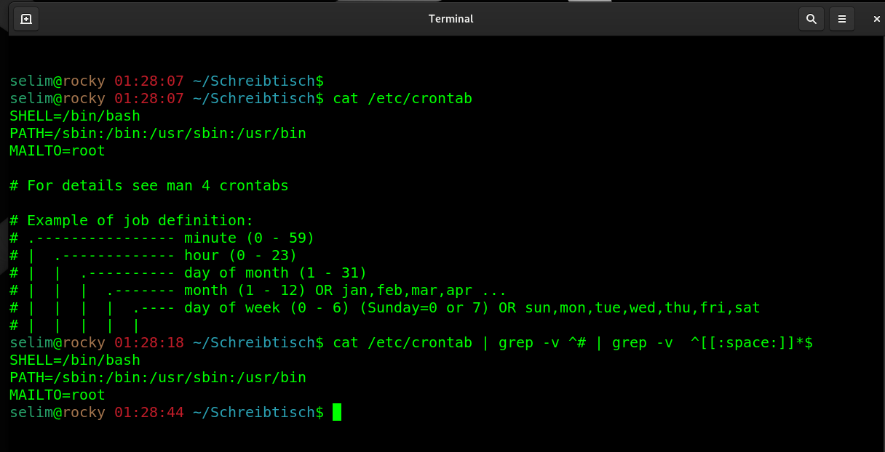

## Run a command that shows all lines except any lines starting with a character "#" in a file.

_verwende grep command und meta characters._


````
cat sample.txt | grep -v ^# | grep -v '^[[:space:]]*$'
````
 

#### Erklarung über die Befehle
Struktur des Befehls:

    cat sample.txt:
        Der Befehl cat gibt den gesamten Inhalt der Datei sample.txt aus.

    | (Pipe):
        Die Pipe | leitet die Ausgabe des cat-Befehls an den nächsten Befehl weiter. In diesem Fall wird die Ausgabe an den ersten grep-Befehl übergeben.

Erster Teil: grep -v ^#

    grep -v ^#:
        grep filtert die Ausgabe basierend auf einem Muster. In diesem Fall wird nach Zeilen gesucht, die nicht dem Muster entsprechen.
        ^ steht für den Anfang der Zeile.
        # ist das Zeichen, nach dem gesucht wird.
        -v bedeutet, dass nur Zeilen, die nicht mit einem # beginnen, in der Ausgabe bleiben.
    ➔ Dieser Teil entfernt also alle Kommentarseilen, die mit # beginnen.

Zweiter Teil: grep -v '^[[:space:]]*$'

    grep -v '^[[:space:]]*$':
        ^ steht wieder für den Anfang der Zeile.
        [[:space:]] ist ein Ausdruck, der für "beliebige Leerzeichen" steht. Dazu gehören Leerzeichen, Tabs, etc.
        * bedeutet "keines oder beliebig viele" der vorherigen Zeichen, also keine oder mehrere Leerzeichen.
        $ steht für das Ende der Zeile.
        -v gibt nur Zeilen aus, die nicht dem Muster entsprechen.

    ➔ Dieser Teil entfernt alle leeren Zeilen oder Zeilen, die nur aus Leerzeichen (oder Tabs) bestehen.

Zusammengefasst:

    cat sample.txt: Zeigt den Inhalt der Datei sample.txt.
    grep -v ^#: Entfernt alle Zeilen, die mit einem # beginnen (Kommentare).
    grep -v '^[[:space:]]*$': Entfernt alle leeren Zeilen oder Zeilen, die nur aus Leerzeichen bestehen.