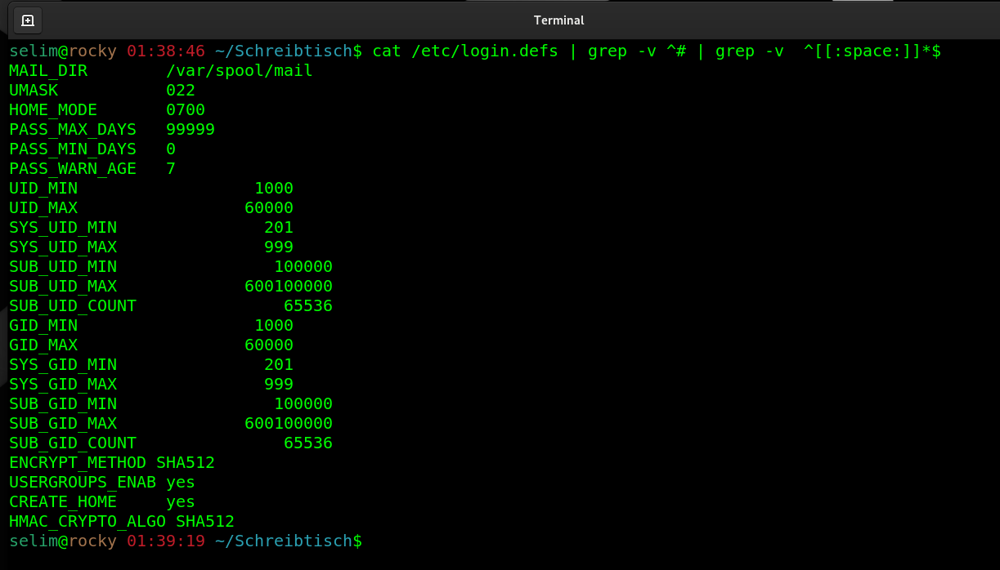
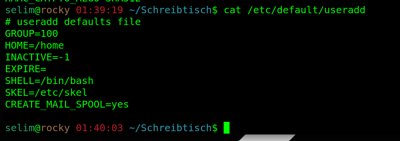

## Which 2 files contain default values creating a user with "useradd" command?


- /etc/default/useradd

- /etc/login.defs

````
cat /etc/login.defs | grep -v ^# | grep -v  ^[[:space:]]*$
````
 

----
----

````
cat /etc/default/useradd | grep -v ^# | grep -v  ^[[:space:]]*$
````
 