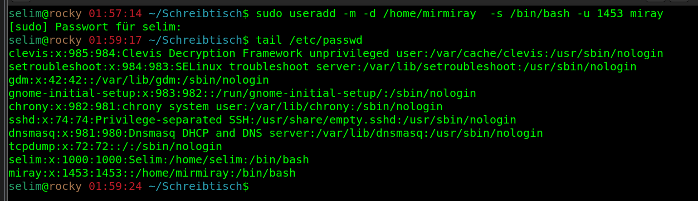
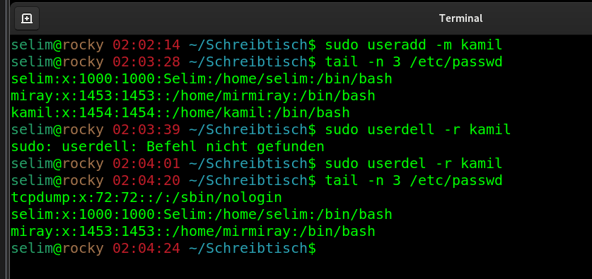
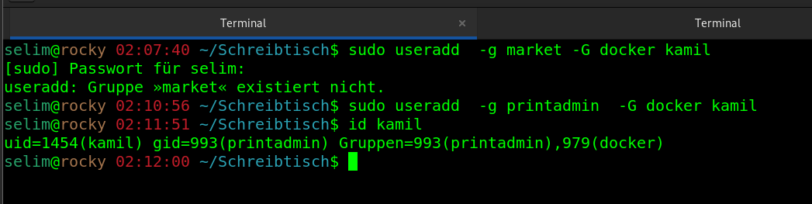
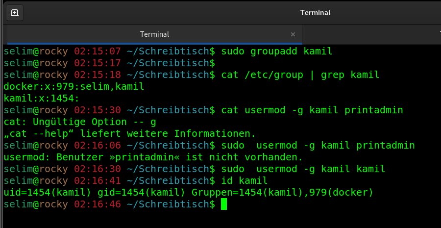
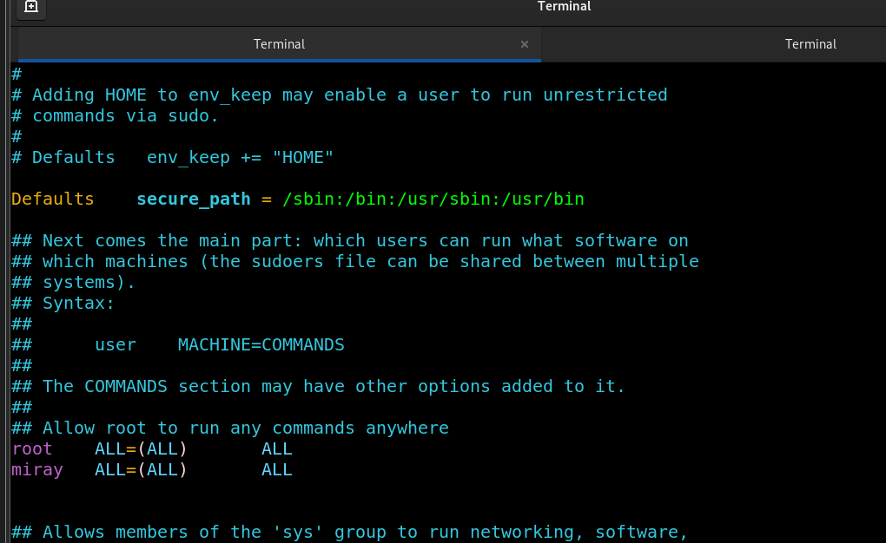

## Add a User with predefinied UID, SHELL and HOME_DIRECTORY

````
sudo useradd -m -d /home/mirmiray  -s /bin/bash -u 1453 miray

````



----
## How to delete a user with its home directory

_"userdell" command with "-r" option dletes home directory._

````
sudo userdel -r <userName>
````



----

## How to create a user specifiying a primary/secondary Group


````
sudo useradd  -g printadmin  -G docker kamil 
````



----

## How to change the Primary Group of a User


````
sudo groupadd kamil

sudo  usermod -g kamil kamil

id kamil
````



----

## How to give a normal User Root_Priviligies

-gir entries in /etc/sudoers with "visudo" command_


````
sudo visud

    " miray ALL=(ALL) ALL "
````

````
sudo su - miray
````



----