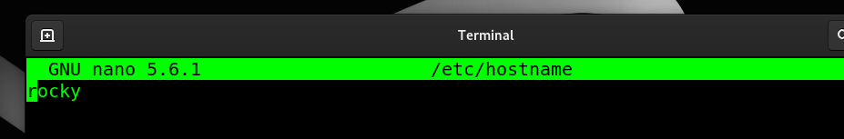

#### Displayin files


````
ls
````

````
ls -a
````

#### Difference between # and $ Promts

 _"#" indicates root user_

 _"$" indicates normal user_


#### How to find am error in a file

````
grep -i error /var/log/messges
````
_if any word icludes error inn messages wil be displayed._
_ "i " ignores Upper or Lower casesensitiviness_


#### How to majke a directory
````
mkdir DirectoryName
````
----
#### How to remove Directory
````
rmdir emptyDirectpry
rmdir -r busyDirectory
````
----
#### build File
````
touch sampleFile
````
----
#### Moving File
````
pwd
mv fileHere fileThere
````
----
#### Delete File
````
rm sampleFile
````
----
#### Default Port of DNS


***Port 53***
----
#### DNS Package Name
***bind*** or ***named***

````
rpm -qa | grep bind
````


---- 
#### Config Files for DNS and its Location
***/etc/named.conf

````
cat /etc/named.conf
# We can get the configuration file of a service :
sudo rpm -qc <service/packageName> 
````
---
#### Where is located ZONE Files for DNS
***/var/named***


---- 
#### List tree types of Filesystems
***ext3, ext4, XFS***


---
#### List any 4 Linux Distros
***debian, ubuntu, XFRedHat, Rocky***

---
#### Logging of from Linux System
***exit***

---
#### Check if a Package is installed
````
rpm -qa | grep <PackageName>
````
---
#### Check previously tyyped commands
````
history
````

--- 
#### Check File Permissions

````
ls -l
````


--- 
#### Fiel Type of a File

````
fiel sampleFile
````


--- 
#### where is password command located 

````
which passwd
````


--- 
#### change File Permissions

````
chmod +x scripting.sh
````

--- 
#### check Network Setting

````
ifconfig -a
ip a
ip r
````


---
#### read Top/Botton of a file

*** head *** or ***tail***

---

#### find Hostnam
````
hostname
sudo hostnamectl set-hostname new-hostname
````


##update hostname 

'''
sudo nano /etc/hostname
'''



*** Update /etc/hosts ****

'''
sudo nano /etc/hosts
'''


---
#### Counting lines word and characters of a file 
*** ls ***
'''
wc -lcw file.txt
'''


---

